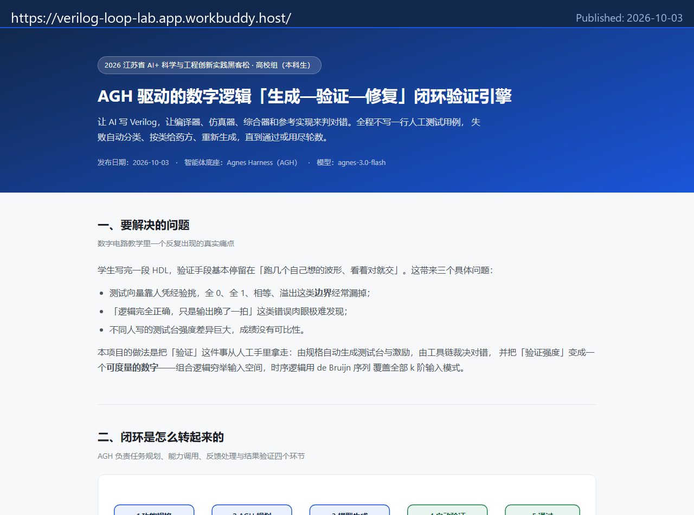
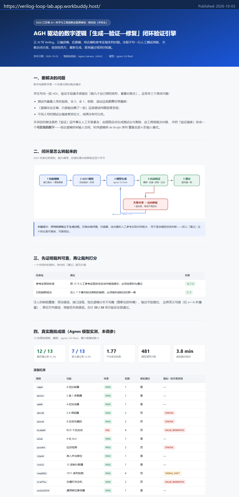

# 提交材料（五）：公开发布记录

> 赛事要求「公开发布至少 1 条内容」。本文件即为该要求的证据页，
> 提交时按「平台 + 链接 + 截图 + 发布日期」四项填写即可。

---

## 一、四项必备信息（直接抄进表单）

| 项目 | 内容 |
| --- | --- |
| 发布平台 | WorkBuddy 应用发布（公开可访问网页，无需登录即可打开） |
| 链接 | https://verilog-loop-lab.app.workbuddy.host/ |
| 发布日期 | 2026-10-03 |
| 截图 | `docs/publish/01_home_top.png`、`docs/publish/02_scores.png`（见下） |

发布内容是一个**项目主页**，不是仓库链接的替代说明页：页面上给出的是本项目的
问题定义、闭环架构、真实跑批成绩、失败分类表、工具调用链证据与复现命令。

## 二、截图





> 若提交系统不支持 Markdown 图片，直接上传 `docs/publish/` 下的两个 PNG 文件。
> 两张截图顶部均带有发布链接与发布日期标注条，可自证。

## 三、公开证据文件（可独立复核）

主页上的每一个数字，都能在仓库里找到对应的原始产物：

| 文件 | 内容 |
| --- | --- |
| `evidence/RESULTS.md` | 13 条规格的逐题成绩表与统计 |
| `evidence/run_20261003_183630.json` | 完整裁决流水（每轮的编译/仿真/综合输出与判定） |
| `evidence/model_journal.jsonl` | 481 次模型调用逐条留痕（用途、成败、时延、字符数） |
| `evidence/selfcheck.md` / `.json` | 元验证记录：参考实现自校准 13/13 + 缺陷注入 7/7 |

> `runs/` 目录本身被 `.gitignore` 排除（体积大），上面这些是**精选后允许公开**的证据副本，
> 不含任何密钥。

## 四、关于「公开仓库」的补充说明

赛事若要求提供代码仓库地址，可任选其一：

**方案 A（推荐，最省事）**：已发布的项目主页 + 打包提交的源码压缩包。
主页本身就是公开可访问的内容，满足「公开发布」条款。

**方案 B（附加）**：把本仓库推到 GitHub 公开仓库。本机没有配置 `gh` 命令行，
需要在 GitHub 网页端新建一个空仓库（不要勾选 README / .gitignore），然后执行：

```bash
cd C:/Users/liumi/WorkBuddy/2026-10-02-20-04-02/agi-verilog-lab
git remote add origin https://github.com/<你的用户名>/<仓库名>.git
git branch -M main
git push -u origin main
```

若使用 SSH 地址，把上面的 URL 换成 `git@github.com:<用户名>/<仓库名>.git` 即可。
推送前请确认 `evidence/` 与 `site/` 已加入提交、且没有任何含密钥的文件（`.env`、
`*.key` 已在 `.gitignore` 中被排除）。

## 五、发布前自查清单

- [x] 页面中不含 API Key、Token 等任何敏感信息（已全文检查）
- [x] 成绩数字与 `evidence/` 中原始产物一致，未作修饰
- [x] 唯一失败项 `bcdadd` 如实保留，未改规格或调参放水
- [x] 第三方组件（iverilog / vvp / yosys）已声明，未修改其源码
- [ ] 姓名 / 学校 / 队伍编号（U104）由参赛者本人补入提交表单
